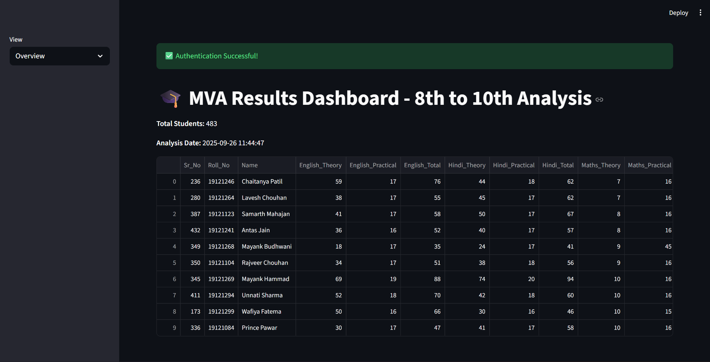
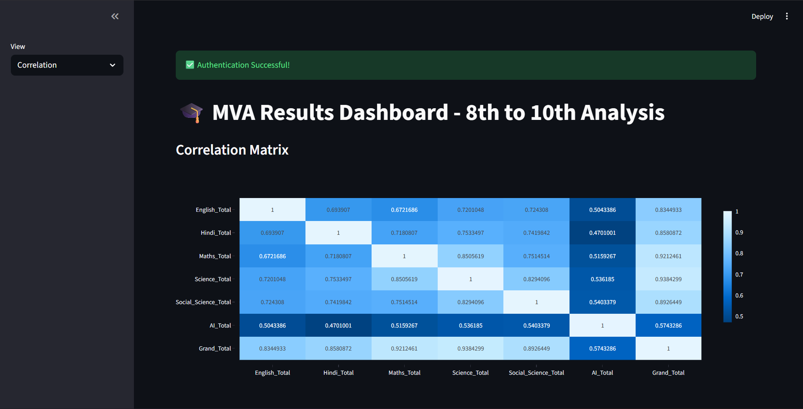
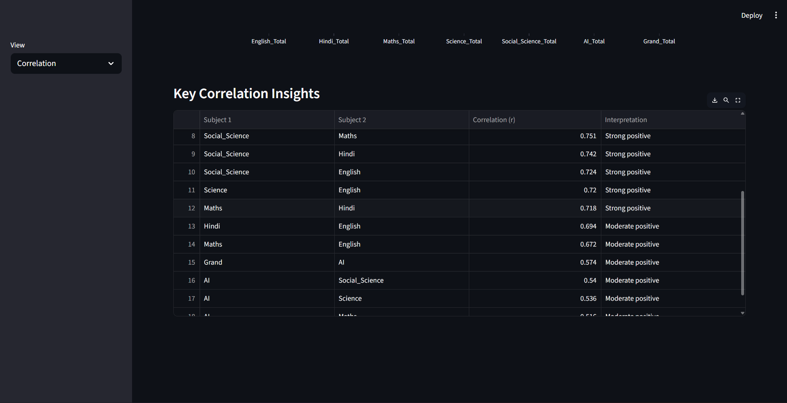
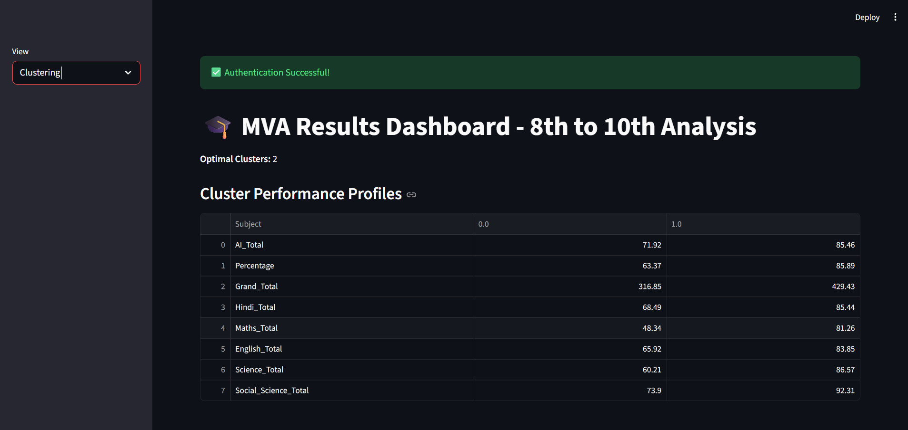
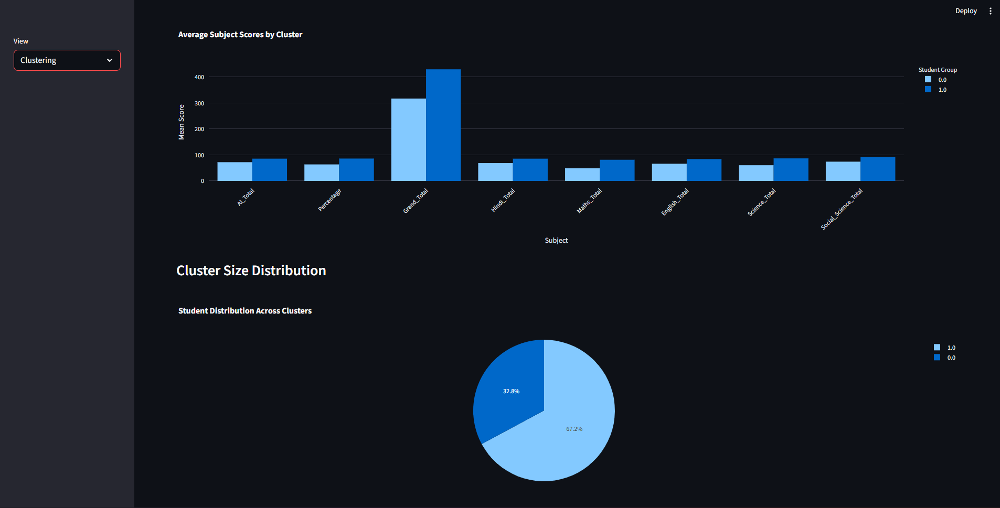
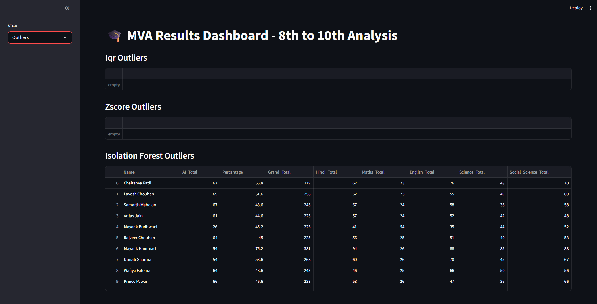

# 🎓 MVA Academic Performance Analyzer – 10th Grade Dashboard

> **Insightful, automated analysis of 10th-grade academic results with AI-powered clustering, outlier detection, and interactive visualizations.**


---

## 🌟 Overview

The **MVA Academic Performance Analyzer** is an end-to-end data science pipeline designed to transform raw 10th-grade marksheet data (from Excel) into **actionable educational insights**. Built for schools and administrators, it automates performance evaluation, identifies at-risk students, compares cohorts, and uncovers hidden patterns using machine learning — all through an intuitive **Streamlit dashboard**.

Originally developed for **MVA School**, this tool supports standardized Indian grading systems (CBSE/State Board) and handles real-world data inconsistencies with robust parsing.

---

## 📄 Excel Sheet Structure (Required Format)

To ensure smooth parsing, your Excel file **must follow this exact structure**:

### ✅ Header Row (Row with column names):
| Sr.No. | Roll No. | Name | English_Theory | English_Practical | English_Total | Hindi_Theory | Hindi_Practical | Hindi_Total | Maths_Theory | Maths_Practical | Maths_Total | Science_Theory | Science_Practical | Science_Total | Social_Science_Theory | Social_Science_Practical | Social_Science_Total | AI_Theory | AI_Practical | AI_Total | Grand_Total | Percentage | New/Old |
|--------|----------|------|----------------|-------------------|---------------|--------------|-----------------|-------------|--------------|-----------------|-------------|----------------|-------------------|-------------|-----------------------|--------------------------|----------------------|-----------|--------------|----------|-------------|------------|---------|

> 💡 **Note**:  
> - The header row can appear anywhere — the script auto-detects it by looking for `"Sr.No."`, `"Roll No."`, `"Name"` in columns 0, 1, 2.
> - “New/Old” is optional — if present, it must be in **column 23 or later** (after Percentage), and values must be `"NEW"` or `"OLD"` (case-insensitive).
> - All subject columns must use the suffix `_Total` (e.g., `English_Total`, `Maths_Total`) for automatic detection.

### ✅ Data Rows:
- Each row = one student
- Columns 0–2: Sr.No., Roll_No., Name (required)
- Columns 3–22: Subject scores (Theory + Practical → Total)
- Column 23+: Optional “New/Old” field
- Empty rows or rows with <5 filled cells are ignored

📌 **Sample File**: See [`sample_data/sample_10th_marksheet.xlsx`](sample_data/sample_10th_marksheet.xlsx)

---

## 🖼️ Screenshots

Here’s what the dashboard looks like:

### 📊 Overview & Subject Performance


> *View total students, average scores, and grade distribution per subject.*

---

### 🔗 Correlation Insights



> *Interactive heatmap + plain-language interpretation of strong correlations.*

---

### 🧩 Clustering Results



> *Students grouped into performance clusters with visual comparison of subject-wise averages.*

---

### ⚠️ Outlier Detection


> *Identify underperformers or top scorers using IQR, Z-score, and Isolation Forest.*

---

> 💡 **How to add screenshots?**  
> 1. Save your dashboard screenshots as `.png` files  
> 2. Place them in an `assets/` folder in your repo  
> 3. Update image paths above accordingly

*(You can generate these screenshots by running the app locally and taking captures!)*

---

## 🛠️ Tech Stack

- **Core**: Python, Pandas, NumPy
- **ML**: scikit-learn (LinearRegression, KMeans, IsolationForest, PCA)
- **Stats**: SciPy (t-tests, z-scores)
- **DB**: SQLAlchemy + MySQL
- **Frontend**: Streamlit + Plotly (responsive, publication-ready charts)
- **Utils**: hashlib, joblib, datetime

---

## 📁 Project Structure

```
MVA_Dashboard/
├── app.py                  # Streamlit entry point
├── data_processor_10th.py  # Core logic: parsing, analysis, dashboard
├── sample_data/            # Example marksheet (Excel)
├── assets/                 # Screenshots (optional)
└── requirements.txt        # Dependencies
```

---

## 🚀 Quick Start

1. **Install dependencies**:
   ```bash
   pip install -r requirements.txt
   ```

2. **Set up MySQL** (optional but recommended):
   - Update `db_config` in your `app.py`
   - The script auto-creates the database and tables

3. **Run the dashboard**:
   ```bash
   streamlit run app.py
   ```

4. **Upload** your 10th-grade Excel marksheet and explore!

> 💡 No Excel file? Use the included `sample_data/sample_10th_marksheet.xlsx` to test.

---

## 📈 Sample Insights

| Insight Type | Example |
|-------------|--------|
| **Performance** | "Average Science score: 78.2 (B1 grade)" |
| **Correlation** | "Maths & Science: r = 0.82 → Strong positive" |
| **Outliers** | "3 students scored >95% — potential toppers" |
| **Clustering** | "Cluster 0: High performers in all subjects" |
| **Risk Alert** | "5 students in 'E' grade — need intervention" |

---

## 🤝 Contributing

Contributions are welcome!  
- 🐛 Found a bug? Open an issue.
- 💡 Have an idea? Submit a feature request.
- ✨ Want to improve? Fork and send a PR.

---

## 📜 License

MIT License — free to use, modify, and distribute for educational or commercial purposes.

---

## 🙏 Acknowledgements

Built with ❤️ for educators and students.  
Inspired by the need for **data-driven decision-making in Indian schools**.

---

> **Empower teachers. Support students. Understand performance.**  
> — *MVA Academic Performance Analyzer*

---

✅ **Ready to deploy in your school?**  
Just upload the marksheet — the rest is automated.
